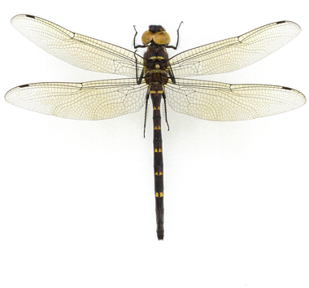
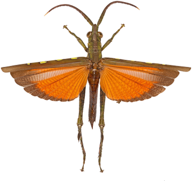
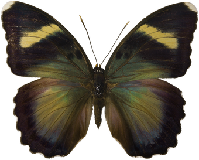

---
title:
date: 2026-07-22
type: landing

sections:
  - block: markdown
    content:
      title:
      subtitle:
      text: |
        

          
          
          
          

            
We are a collaborative and interdisciplinary research group studying how insects and ecosystems respond to climate change, urbanization, and agricultural intensification. We are also interested in macroecology and the processes shaping insect diversity at broad spatial, temporal, and taxonomic extents. Our work is motivated by a desire to inform conservation, biological understanding, and climate adaptation.

            

              <a class="bl-btn bl-btn-primary" href="./research/">Explore our research</a>
              <a class="bl-btn bl-btn-ghost" href="./people/">Meet the team</a>
            

          

        

    design:
      columns: '1'

  - block: markdown
    content:
      title:
      subtitle:
      text: |
        

          <h2>Research Themes</h2>
          
We integrate museum collections, participatory science, remote sensing, and our own fieldwork to understand how insects respond to global change, and we translate that into conservation and climate adaptation practice.

        

        

          <a class="bl-card" href="./research/">
            <h4>Insect declines &amp; climate adaptation</h4>
            
Quantifying population and community trends to inform assemblage-level conservation.

          </a>
          <a class="bl-card" href="./research/">
            <h4>Phenology &amp; phenotypic response</h4>
            
How insect timing and body size shift with climate and urbanization, using computer vision at scale.

          </a>
          <a class="bl-card" href="./research/">
            <h4>Macroecology &amp; biodiversity informatics</h4>
            
Statistical and machine-learning tools that make museum and participatory-science data more useful.

          </a>
          <a class="bl-card" href="./research/">
            <h4>Urban ecology</h4>
            
How cities reshape insect communities across life stages.

          </a>
        

    design:
      columns: '1'
---
